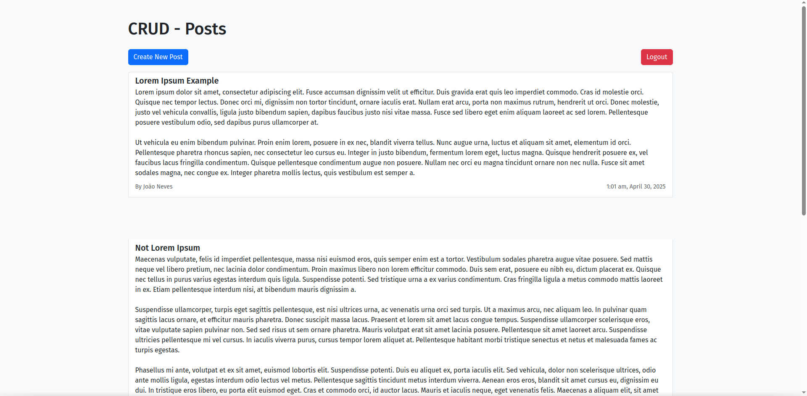
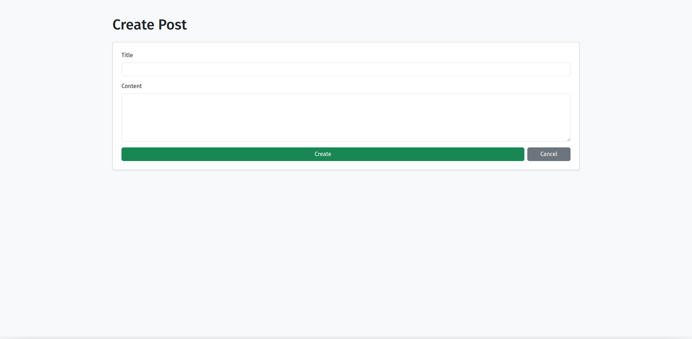
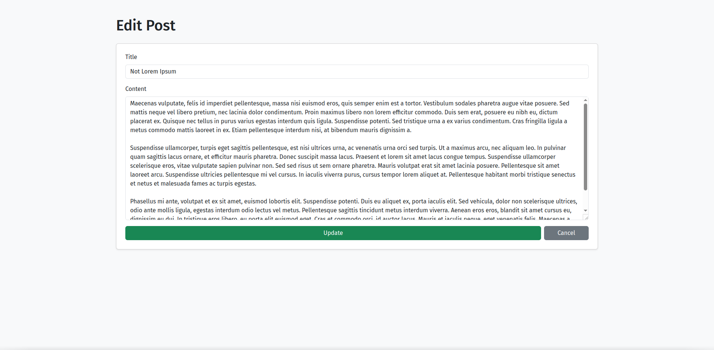
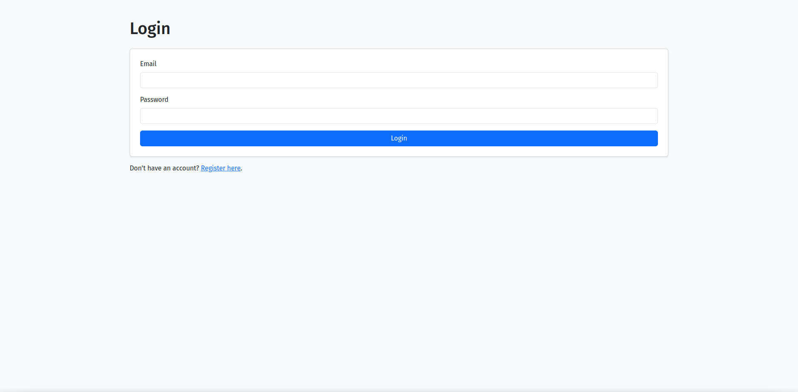
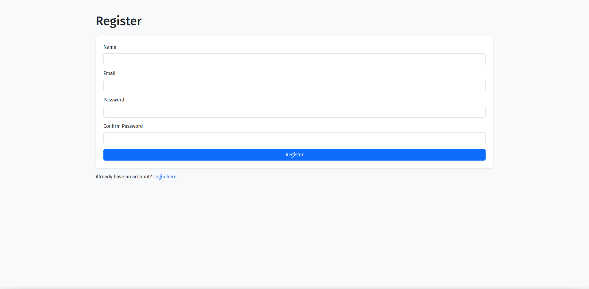

# Base CRUD PHP + MVC

## Overview

This is a simple PHP-based CRUD (Create, Read, Update, Delete) application built using the MVC (Model-View-Controller) architecture and the Twig templating engine. The project allows you to easily manage and perform CRUD operations on a MySQL database. It can be used as a template or base for more complex web applications. Posts can be seen by everyone but are only editable depending on the user that is logged in.

## Features

- **MVC Structure**: Clean separation of logic into Models, Views, and Controllers.
- **Twig Templating Engine**: Uses Twig for rendering HTML views, making the code more organized and easy to maintain.
- **CRUD Operations**: Fully functional CRUD operations (Create, Read, Update, Delete) for managing records in the database.
- **Database Integration**: MySQL database integration via PDO (PHP Data Objects).
- **Responsive Design**: Uses Bootstrap for responsive UI (if chosen during setup).

## Requirements

Before you begin, ensure you have met the following requirements:

- PHP 7.4 or higher
- Composer (for managing dependencies)
- MySQL or MariaDB
- Apache (or any server capable of running PHP)
- Internet connection (for downloading dependencies)

## Installation

Follow these steps to set up the project locally:

### 1. Clone the Repository

Clone the project repository to your local machine:

```bash
git clone https://github.com/jgneves-dev/base-crud.git
cd base-crud
```

### 2. Install Dependencies

Use Composer to install all required PHP packages:

```bash
composer install
```

### 3. Create the Database

You will need to create a new MySQL (or MariaDB) database to store the application's data. You can create it manually or use phpMyAdmin.

Example SQL to create a database:

```sql
CREATE DATABASE base_crud;
```

### 4. Set Up the `.env` File

The project uses environment variables for database credentials. Copy the example `.env` file and modify it to fit your database setup.

```bash
cp .env.example .env
```

Edit the `.env` file with your database credentials:

```dotenv
DB_NAME=your_database_name
DB_USER=your_database_username
DB_PASS=your_database_password
```

### 5. Configure the Virtual Host (Optional)

If you want to access the project via a local domain (like `base-crud.local`), you need to configure Apache's virtual host.

- Copy the configuration below to `/etc/httpd/conf/extra/httpd-vhosts.conf` (or the relevant Apache config file):
  
  ```apache
  <VirtualHost *:80>
      DocumentRoot "/srv/http/base-crud/public"
      ServerName base-crud.local
      <Directory "/srv/http/base-crud/public">
          AllowOverride All
          Require all granted
      </Directory>
  </VirtualHost>
  ```

- Add this line to your `/etc/hosts` file:

  ```bash
  127.0.0.1 base-crud.local
  ```

- Restart Apache to apply the changes:

  ```bash
  sudo systemctl restart httpd
  ```

### 6. Run the Application

You can run the project locally using PHP's built-in server:

```bash
php -S localhost:8000 -t public
```

Visit [http://localhost:8000](http://localhost:8000) in your browser.

### 7. Create the Database Tables

Create the necessary tables in your database for storing posts (or any other data). You can do this manually using an SQL tool, or you can create a simple script to insert the table structure.

For example, create a `posts` table:

```sql
--
-- Database: `base_crud`
--

-- --------------------------------------------------------

--
-- Table structure for `posts`
--

CREATE TABLE `posts` (
  `id` int(11) NOT NULL,
  `title` varchar(255) NOT NULL,
  `content` text NOT NULL,
  `created_at` timestamp NULL DEFAULT current_timestamp(),
  `user_id` int(11) NOT NULL
) ENGINE=InnoDB DEFAULT CHARSET=utf8mb4 COLLATE=utf8mb4_unicode_ci;

--
-- Extracting data from the `posts` table
--

INSERT INTO `posts` (`id`, `title`, `content`, `created_at`, `user_id`) VALUES
(1, 'Lorem Ipsum Example', 'Lorem ipsum dolor sit amet, consectetur adipiscing elit. Fusce accumsan dignissim velit ut efficitur. Duis gravida erat quis leo imperdiet commodo. Cras id molestie orci. Quisque nec tempor lectus. Donec orci mi, dignissim non tortor tincidunt, ornare iaculis erat. Nullam erat arcu, porta non maximus rutrum, hendrerit ut orci. Donec molestie, justo vel vehicula convallis, ligula justo bibendum sapien, dapibus faucibus justo nisi vitae massa. Fusce sed libero eget enim aliquam laoreet ac sed lorem. Pellentesque posuere vestibulum odio, sed dapibus purus ullamcorper at.\r\n\r\nUt vehicula eu enim bibendum pulvinar. Proin enim lorem, posuere in ex nec, blandit viverra tellus. Nunc augue urna, luctus et aliquam sit amet, elementum id orci. Pellentesque pharetra rhoncus sapien, nec consectetur leo cursus eu. Integer in justo bibendum, fermentum lorem eget, luctus magna. Quisque hendrerit posuere ex, vel faucibus lacus fringilla condimentum. Quisque pellentesque condimentum augue non posuere. Nullam nec orci eu magna tincidunt ornare non nec nulla. Fusce sit amet sodales magna, nec congue ex. Integer pharetra mollis lectus, quis vestibulum est semper a.', '2025-04-30 00:01:45', 1),
(3, 'Not Lorem Ipsum', 'Maecenas vulputate, felis id imperdiet pellentesque, massa nisi euismod eros, quis semper enim est a tortor. Vestibulum sodales pharetra augue vitae posuere. Sed mattis neque vel libero pretium, nec lacinia dolor condimentum. Proin maximus libero non lorem efficitur commodo. Duis sem erat, posuere eu nibh eu, dictum placerat ex. Quisque nec tellus in purus varius egestas interdum quis ligula. Suspendisse potenti. Sed tristique urna a ex varius condimentum. Cras fringilla ligula a metus commodo mattis laoreet in ex. Etiam pellentesque interdum nisi, at bibendum mauris dignissim a.\r\n\r\nSuspendisse ullamcorper, turpis eget sagittis pellentesque, est nisi ultrices urna, ac venenatis urna orci sed turpis. Ut a maximus arcu, nec aliquam leo. In pulvinar quam sagittis lacus ornare, et efficitur mauris pharetra. Donec suscipit massa lacus. Praesent et lorem sit amet lacus congue tempus. Suspendisse ullamcorper scelerisque eros, vitae vulputate sapien pulvinar non. Sed sed risus ut sem ornare pharetra. Mauris volutpat erat sit amet lacinia posuere. Pellentesque sit amet laoreet arcu. Suspendisse ultricies pellentesque mi vel cursus. In iaculis viverra purus, cursus tempor lorem aliquet at. Pellentesque habitant morbi tristique senectus et netus et malesuada fames ac turpis egestas.\r\n\r\nPhasellus mi ante, volutpat et ex sit amet, euismod lobortis elit. Suspendisse potenti. Duis eu aliquet ex, porta iaculis elit. Sed vehicula, dolor non scelerisque ultrices, odio ante mollis ligula, egestas interdum odio lectus vel metus. Pellentesque sagittis tincidunt metus interdum viverra. Aenean eros eros, blandit sit amet cursus eu, dignissim eu dui. In tristique eros libero, eu porta elit euismod eget. Cras et commodo orci, id auctor lacus. Mauris et iaculis neque, eget venenatis felis. Maecenas a aliquam elit, sit amet suscipit tortor. Duis non placerat lectus, ac congue magna. Fusce consequat ornare ligula quis bibendum. Donec nibh ante, cursus ac tempus ac, suscipit nec lacus. Donec sit amet sem non est efficitur cursus vitae nec lectus.', '2025-04-30 00:09:06', 2),
(4, 'qwdawd', 'adadaddddddddddddddddddddddddddddddddddddddddddddddddddddddddddddddddddddddddddddddddddddddddddddddddddddddddddddddddddddddddddddddddddddddddddddddddddddddddddddddddddd NOPE', '2025-04-30 00:14:38', 1),
(5, 'Power outage in Portugal and Spain was the "most severe" in the last 20 years in Europe', 'With the power service fully restored, as well as the water supply - which affected some areas -, it is now time for reviews, evaluations, and criticism. The government and Civil Protection are being targeted by protests for the "failure" and "delay" in response. For now, and without an official explanation for what left Portugal and Spain in the dark, Luís Montenegro announced he would request a European audit and evaluate "failures in SIRESP".', '2025-04-30 00:45:28', 2);

-- --------------------------------------------------------

--
-- Table structure for `users`
--

CREATE TABLE `users` (
  `id` int(11) NOT NULL,
  `name` varchar(255) NOT NULL,
  `email` varchar(255) NOT NULL,
  `password` varchar(255) NOT NULL,
  `created_at` timestamp NULL DEFAULT current_timestamp()
) ENGINE=InnoDB DEFAULT CHARSET=utf8mb4 COLLATE=utf8mb4_unicode_ci;

--
-- Extracting data from the `users` table
--

INSERT INTO `users` (`id`, `name`, `email`, `password`, `created_at`) VALUES
(1, 'João Neves', 'joaoneves@admin.com', '$2y$12$g8fu4z94iN2.7/d0iDE/terLElyAfA1wUWleSEzpvgEaMmOOeZu8K', '2025-04-30 00:14:13'),
(2, 'Administrator', 'admin@admin.com', '$2y$10$yv7YON0Y4C9QUfgmydVF4uFoEX1fTYwYiLCesVhCKfEaPbJz4HfIK', '2025-04-30 00:29:30');

--
-- Indexes for dumped tables
--

--
-- Indexes for `posts` table
--
ALTER TABLE `posts`
  ADD PRIMARY KEY (`id`),
  ADD KEY `fk_user` (`user_id`);

--
-- Indexes for `users` table
--
ALTER TABLE `users`
  ADD PRIMARY KEY (`id`),
  ADD UNIQUE KEY `email` (`email`);

--
-- AUTO_INCREMENT for dumped tables
--

--
-- AUTO_INCREMENT for `posts` table
--
ALTER TABLE `posts`
  MODIFY `id` int(11) NOT NULL AUTO_INCREMENT, AUTO_INCREMENT=6;

--
-- AUTO_INCREMENT for `users` table
--
ALTER TABLE `users`
  MODIFY `id` int(11) NOT NULL AUTO_INCREMENT, AUTO_INCREMENT=3;

--
-- Constraints for dumped tables
--

--
-- Limiters for `posts` table
--
ALTER TABLE `posts`
  ADD CONSTRAINT `fk_user` FOREIGN KEY (`user_id`) REFERENCES `users` (`id`) ON DELETE CASCADE;
COMMIT;
```

### 8. Enjoy Your Project

After completing these steps, you can start adding, editing, and deleting posts via the web interface.

## Usage

Once you have the application running, you can perform the following actions:

- **Create a Post**: Navigate to [http://localhost:8000/posts/create](http://localhost:8000/posts/create) to add a new post.
- **View Posts**: Navigate to [http://localhost:8000/posts](http://localhost:8000/posts) to see all posts in the database.
- **Edit Posts**: Visit the edit page of a post via [http://localhost:8000/posts/{id}/edit](http://localhost:8000/posts/{id}/edit).
- **Delete Posts**: Posts can be deleted through the user interface as well.

## Project Structure

The project follows the **MVC** (Model-View-Controller) architecture:

```
.
├── app/
│   ├── Controllers/          # Controllers for handling logic
│   ├── Models/               # Models for interacting with the database
│   └── Views/                # Twig templates
├── config/                   # Configuration files (e.g., database.php)
├── public/                   # Public assets (index.php, .htaccess)
├── .env.example              # Example environment file (copy to .env)
├── composer.json             # Composer dependencies
└── README.md                 # This file
```

- **Controllers**: Contain logic for handling requests, interacting with models, and rendering views.
- **Models**: Represent the data and handle interactions with the database.
- **Views**: Twig templates for rendering HTML pages.
- **Config**: Contains the database connection setup and other configuration files.

### Routes

- `/posts/create`: Form to create a new post.
- `/posts`: List all posts.
- `/posts/{id}`: View a specific post.
- `/posts/{id}/edit`: Edit an existing post.
- `/login`: Login to the posts view.
- `/register`: Register a new user.
- `/logout`: Logout and go back to login page.

## Technologies Used

- **PHP**: The server-side scripting language used in the project.
- **MySQL**: The relational database management system for storing application data.
- **Twig**: The templating engine used for rendering HTML views.
- **FastRoute**: A simple routing library for PHP.
- **Bootstrap**: Front-end framework for responsive web design.

## Screenshots

Here are a few screenshots of the project in action:

1. **Homepage**: 
   
2. **Create Post Form**:
   
3. **Edit Post Form**:
   
4. **Login Form**:
   
5. **Register Form**:
   

## License

This project is open-source and available under the [MIT License](LICENSE).
---
